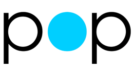

# Prototyping Magic

---


# おはようございます!

^ Ohayou gozaimasu!

---

# Who am I?
- Adam Bell
- Canadian
- @b3ll on Twitter
- iOS Engineer @ Facebook (App Experiences)
	- Animation and Music are my specialties.
- *#gottagofast*

^ Hey everyone, my name is Adam Bell (@b3ll on Twitter), and I'm a Canadian iOS Engineer currently working at Facebook on iOS App Experiences. I've been with the iOS community ever since the dawn of the iPhone and spent most of my early days dabbling in iOS' internals. Over the years I've released things on both the App Store and the Cydia Store.

--- 

# A Bit of History...

- Started out with Cydia: 
	- MessageBox: Chat Heads hack for the Facebook App (and Paper)
	- Stride: Unlock your phone with touch gestures
- Helped me learn a bunch about the internals of iOS.

^ It's possible you already know of or used my stuff in the past: MessageBox was a hack for the Facebook app to allow Chat Heads to be used anywhere, and Stride was a way to unlock your phone with gestures (instead of passwords).

--- 

# A Little Bit More of History...

- Also did some work on the App Store: 
	- Reprise: DJ-inspired Music Player
	- ARTPOP: Lady Gaga's companion app for the album album

^ I also worked with Relative Wave and helped build ARTPOP, Lady Gaga's companion app to her album. Usually my passions in iOS are to do with animations, gestures, music, and interactivity.

--- 

# The Early Days

^ That's enough about me though... there's a lot to cover, so I'm going to be switching topics rather swiftly. ;) *baddum tss*

^ I'd like to start things off with a video that recently cropped up in my Twitter feed, from the very early days of iOS. Does anyone here remember this? 

---


--- 


# iBooks

^ There were two things that I remember getting excited about when I saw this video: the iPad itself (obviously, it's half a laptop you can touch, that's crazy talk), and the animations and interactions featured throughout the commercial were incredible!

^ Look at the motion in how the iBooks app opens books: the books fly forward and open up in 3D. You can turn pages with a page curl, and flip the entire app over to buy more books from the Store.

---

# Photos


^ Look at how the photos expand from an album in the photos app. You're literally peeking into a collection of stacked images... you end up manipulating digital representations of real-world photograph albums.

---

# Mail


^ Even the Mail app stacks multiple emails like stacks of paper when you're selecting a bunch of them, it all feels expected and super useful as you're given a discrete context as to what's happening.

---

# Motion

- Obvious with their intent.
- Enhance the experience of the app.
- Feel like *magic*.

^ These animations and interactions, with continuous motion and fluidity are what make apps feel great. They're obvious with their intent and enhance the experience of using the app.

^ These interactions are something special; they feel surreal... almost magical. 

^ There's a reason for that, and it's one of my favourite quotes:

---

> "Any sufficiently advanced technology is indistinguishable from magic."
-- Arthur C. Clarke

^ iOS has always been a source of magic, an inspiration for most, if not all of us! It's leagues ahead of the competition and there've been countless innovations over the years on how we interact with the device. Remember how effortless and magical TouchID felt when you first tried it? If you say that you weren't totally stoked when you first tried it out, you're lying to yourself.

---


# iOS 7

^ With iOS 7 came a new splash of paint, but it also simplified everything drastically. iOS 7 focussed on consistency; every part of the system should act the exact same way. This also meant that it stripped away a lot of the old interactions and replaced them with newer ones that were less animated, less gestural, and much more robotic in nature. The sad part about this change is that it's not necessarily a good thing. There's much less delight and magic in the apps we're seeing nowadays vs. how they used to be.

---


# Passbook

# :smile:

^ Take Passbook (now called Wallet) for example... Here's a comparison of the change that happened between iOS 6 and iOS 7. If you wanted to delete a pass, you'd pick up a pass, and tap the garbage can. *bzzzzzzt* the whole thing becomes cut into little bits and thrown away. Even the action sheet itself was the shredder! It was immediately obvious what happened, and had a fun illustration of how it happened. 

---

# Wallet


# :disappointed:

^ However, with iOS 7, any bits of code related to that paper shredder were thrown out and "shredded". This in turn ended up being replaced with replaced with a soulless... line... that disappears? Passes disappearing into nothingness does indicate what's going on... Kinda... But it's confusing to most people. 

^ The magic is gone.

---

# Twitter for iPad 

---


^ Anyone remember the original Twitter app for iPad? It had this crazy ability to pull tweets out of your timeline to "peek into" and interact with. You had this hierarchy of sliding panes that would stack and compress like an accordion; you could immediately see where you were in the app, it was wicked cool. 

---

# Twitter for iPad... Pro?

---


^ Fast forward to 2016... Well... I think the screenshot speaks for itself. It's a shame that such clever and interesting interactions were flattened into a giant stretched out iPhone app.

---


# Garageband

^ If you want to see an app that feels incredible on iPad Pro, check out Garageband. It feels like a really professional app, with which you can interact with anything. Any instrument you touch makes a sound and animates, any button you press has immediate feedback. There's so much playfulness available, that creativity basically synthesizes itself. This is an example of how apps should *feel*.

---


## Skeumorphism?

^ Now some of you might be thinking that I'm talking about a thing called "Skeumorphism". You might be saying to yourselves that "Apple only removed the "skeumorphic" element of apps in iOS 7". However, there's a huge difference between skeumorphism and interaction. 

---

> *Skeumorphism*: the act of making something digital resemble its real-world counterpart. 

---

>  *Interaction*: the fashion in which one thing can affect another thing.

---

## Skeumorphism ≠ Interaction

^  With iOS, "skeumorphism" is making your photo collection app look like a scrapbook, whereas "interaction" is the way you allow people to manipulate images on a screen. Interactions enable apps to become useful and sensible, but when you pair animations and interactions, apps become playful.

--- 

# Animations
- Define and bring closure to actions.
- Make sense of what's happening.
- Create a navigational hierarchy of intent.

^ Animation is a critical element of interaction, it's what fills in the gaps between the periods of time of time before, during, and after an interaction. It defines, and brings closure to actions; it makes sense of what's happening. If you're opening a document or form of media, it should zoom or be pushed into view. If you're closing a document, it should be pushed offscreen in an expected manner. Not only are these visual cues easier on the eyes, but it allows whoever's using an app to understand where exactly they are in the application. It creates a hierarchy of intent and allows a navigational construct to exist.

---

> "Flat and simple" apps are sidelining animation and interaction.

^ For a lot of apps nowadays, these intents aren't always as clear. With this transition to "flat and simple", animations are typically sidelined and brought in as an afterthought. When we're living in a world where features and shipping out the door as fast as possible are priorities, the extra 5% needed to make something really special ends up being cast away.

---

# Top 3 Excuses

Nowadays features and shipping speed are a priority:

1. They're unnecessary.
2. They're slow.
3. They're hard to build.

---

# aka

1. Psychological Intent.
2. Technological Capability.
3. Laziness.

^ If we simplify these reasons a bit further, we end up with 3 tiers: psychological intent, technological capability, and laziness.

---

# "Animations are unnecessary."

### Why?

- Do they result in a poorer experience?
- Do they make the experience confusing?
- How do we mitigate confusion?

---

> Animations tell a story.

^ Animations breathe life into our apps, they tell a story.

---

> Animations are about *progression*.

^ Animations are really about progression. They should be subtle in nature; little hints at what's happening. Think of it as eating candy, some candy is delightful, but if you eat an entire bag of it, you're going to have a bad time. 

--- 

# Don't disable all animations.

---

> If you disable animations, you're robbing someone of their ability to **understand**.

^ If you completely disable animations throughout your app, you're robbing whoever's using your app of their ability to experience your app's story; you're handing someone a book and telling them the amazing cliffhanger ending in the first chapter. 

---

# Don't go overboard.

^ If you go to town and animate everything, all you're really doing is provoking someone to have a seizure. Like this:

---


---

> Animations need purpose. Perform animations with a specific intent.

^ Animations need a purpose, and part of that purpose ends up being progressively explaining events that occur. 

---

> Explain "how did I get here" through animation and interaction.

^ "How did I get here?" is an excellent example of a question that you should answer through animation.

---

## Recap:
- Animations should be subtle in nature.
- Animations should indicate a specific intent.
- Animations should compliment interactions and events. 

^ Do perform animations with specific intent: to draw attention to something that's going on, or indicate events that are going to occur. Don't add animations for the sake of adding animations, they need to mean something.

---

# "Animations are slow."

- What part is slow?
- Do they drop frames?
- Do they run for too long?

---

# Core Animation is /Not/ Slow

- All animations on iOS are done out of process: `CARenderServer`
- They're done on the GPU.
- They're given top priority.
- They won't ever be slow unless your app physically taxes the system.

^ Now on iOS, Core Animation is actually specifically designed to ensure that animations don't drop frames, since all animations are performed out of process. Core Animation talks to a specific process called `CARenderServer`, which is given higher priority than your app. This means that all animations aren't at the mercy of how quick your application is, since the animations run outside your app. So unless you're doing some crazy unoptimized drawing calls and animating those, normal Core Animation animations shouldn't slow anything down. So animations on iOS aren't technically slow, but they can run for **way** too long.

---

# Slow Animations are Slow

- Slow animations are more painful than laggy ones.
- Don't go overboard: Excessively long animations are infuriating.
- Subtle animations are quick and satisfying.

^ Slow animations can actually be more painful than laggy ones. If you're zooming into a document, and it takes 5 seconds to zoom in, that's kind of excessive.

---


^ It would also be completely infuriating to anyone using your app if they had to wait ... until your animation completed ... every single ... time ... you did something.

---

> If someone has to fight with your app... they will **delete** it.

^ If you're causing the person using your app to wrestle with whatever you made, the first thing they're going to do is delete it.

---

# :angry:

---

> They will then rate your app one star and yell at you.

^ The second thing they're going to do is write a review about how terrible of a person you are and how they can fix your app for you. 

---


---

> You will be sad. :disappointed:

^ Nobody wants either of those.

---


## Recap:
- Use animations with a specific intent.
- Be simple and quick.

^ If the intent is to show a page turning, show a page turning. No sensible person on this planet will ever take 5 seconds to turn a page of a book, so turn that 5 seconds into 0.5 seconds. Remember: perform animations as a compliment to interaction.

---

> Good animations educate.  
> Bad animations frustrate.

^ Don't use animations to frustrate, use animations to educate.

---

> Delightful animations paired with interactions make people smile. 

^ Delightful animations paired with interactions make people smile.

---


---

# "Animations are hard to build."

- Don't take the easy route, challenge yourself.
- As an engineer, problem solving is your forte.
- Building a beautiful animation is extremely rewarding to both yourself and whoever uses your app.

^ "They're hard to build.". Whilst this can sometimes be true, they can also be extremely rewarding to build. Good animations and dynamic interactions take a lot of time to build but they're really what makes your work stand out.

^ Challenge yourself to build something great. As an engineer, you're very smart, and tough problems to solve should make you excited and determined to succeed.

---

> "When a designer hands you something to build...  
> don't say no."

^ Difficulty should never be a reason to compensate or "settle". If you're working with a team, and a designer hands you a really cool idea to build, it's not your job to tell them "that's too hard to make.".

---

# Iterate. Don't delete.

- Difficulty should never be a reason to settle and scrap an idea.
- If something is too taxing on the system, iterate on the idea.
- Work together to create something great!

^ Now sometimes designs can be genuinely too taxing on the system and they're not possible, but that's where iteration comes in.

^ Iterate on a design and make it adapt, adjust it to make it better. It's genuinely detrimental to someone's morale when you crush their ideas, so work together to create something great! Iteration is always better than deletion. 

---

# Speaking of iteration...

---

> Prototyping allows you to understand the potential of what you will build, and perfect what you are building.

---

# How?

---

# Prototyping Tools

- Loads of tools to help you build and prototype animations.
- Origami, Quartz Composer, Form, Framer, Pixate, etc.

^ There are lots of tools at your disposal to help you make animations. If you're a designer tools like Origami / Quartz Composer and After Effects can be valuable assets.

---

# What about Xcode?

---

> Before Swift, Xcode was *terrible* for prototyping.

^ If you're an engineer, however, you don't really get much other than Xcode and Build & Run...

---

# However...

---


# Xcode Playgrounds

^ that is, until Swift and Xcode Playgrounds became a thing.

^ Here's where the real magic can happen.

---

# Xcode Playgrounds Are Awesome.

---

# Xcode Playgrounds

- Powered by... Swift!
- Amazing for iterating on ideas.
- Changes update in real-time.
- Code can be reused line-for-line.

^ Xcode Playgrounds compile and run your app in real-time. Any modifications will be updated dynamically so it's excellent for iteration. Most design tools enable you to whip up a quick mock of how something should perform, you end up creating an imitation of how it will turn out. With Playgrounds any code you write isn't an imitation of how it will act, it's line-for-line exactly what will happen when your code is executed. It's also great for working on layout, where pushing pixels can be cumbersome across multiple build cycles.

---

# Interactive Xcode Playgrounds

- Xcode playgrounds now support touches! :tada:
	- UIGestureRecognizer? Yep.
	- UIPanGestureRecognizer? Yep.
	- UI\*GestureRecognizer? Yep.

^ With Xcode 7.3 came the release of interactive Xcode Playgrounds. Interactive Playgrounds? You might be thinking to yourself "aren't Xcode Playgrounds already interactive? That was the whole point of Xcode Playgrounds...". Yes, Xcode Playgrounds will interactively re-run your program as it's written super quickly, but that's not the type of interactivity I'm talking about. I'm talking about interactivity in the form of gestures. Xcode Playgrounds now support touch events and allow you to prototype gestural interactions.

^ You've basically got a full blown iPhone Simulator running alongside your Swift code which opens countless possibilities.

---

# Xcode Playgrounds + Gestures

- Take forever to setup, loads of boilerplate code:

```swift
let tapGestureRecognizer = UITapGestureRecognizer(self, selector:Selector("doTheThing:"))
aView.addGestureRecognizer(tapGestureRecognizer)
@objc private func doTheThing(tapGestureRecognizer: UITapGestureRecognizer) {
  switch(tapGestureRecognizer.state) {
  case: UIGestureRecognizerStateEnded:
    print("ohai")
    break
  default:
    break
  }
}
```

^ Now when you're building interactions and animations, typically you'll want to use `UIGestureRecognizer`s.

^ Now there's always an incredible amount of boiler plate code that's required for setting up `UIGestureRecognizer`s, which can make it pretty cumbersome to want to use for rapidly prototyping things. Here's how many lines are typically required to setup a UITapGestureRecognizer:

---

# gross.

^ That doesn't look like simple prototyping code to me...

---

# Let's fix that.

^ What happens if we only had to write like 4 lines?

---

# :tada: SwiftyGestureRecognition :tada:

```swift
let tapGestureRecognizer = UITapGestureRecognizer(view: aView)
  .didEnd { (gestureRecognizer) in
    print("ohai")
  }  
```

\#yatusabes

---


## woah.

## wat.

---

# SwiftyGestureRecognition

- Similar syntactic sugar to Alamofire.
- Hacks internalized with Objective-C's Associated Objects.
- Trailing closures are magic.

^ This chaining is similar to the syntactic sugar that comes with something like Alamofire; everything's chained together and makes it extremely easy for prototyping. Now from the outside it looks dead simple, but that's only because internally some hacks were used.

---

# Let's take a look!

---

> What about prototyping animations?

--- 



---

# POP

- Excellent library for writing interactive / advanced animations.
- Powered by Core Animation.
- Open Source!

^ If you've been writing animations recently, you might've come across a little library called POP. POP is an animation framework that was built for the sole purpose of extending the awesomeness that is Core Animation. 

---

>  "Why not just use Core Animation only?"

---

## Nothing wrong with Core Animation. 

## I :heart: Core Animation.

---

# CALayer is hard.

---

# CALayer

- Powered by two internal layers:
	+ Presentation Layer: State during an animation.
	+ Model Layer: State when no animation is active.
- Animation only changes the Presentation Layer.

^ CALayer is backed by two other layer: a presentation layer, and a model layer. The presentation layer acts as the current state of a layer when an animation is running, whereas the model layer defines how the layer should be when no animation is applied.

---

## Interrupting animations properly on CALayer is hard.

^ Part of the problem with Core Animation is the amount of effort required to properly stop an animation. Simply calling `-removeAnimationForKey:` or `-removeAllAnimations` results in the animation either resetting to the beginning or jumping to the very end of the animation, which isn't exactly stopping an animation. If a car is speeding forwards, and you slam on the brakes, what does the car do? It jumps back to the beginning... right? Nope. If you're building something that you can pick up, throw, re-grab, and then pick up again, there's a lot of code required to do that. 

---

# CALayers can get out of sync.

^ The fact that the presentation layer and the model layer can become out of sync, is what leads the CALayer to jump to it's beginning / end state after calling `-removeAnimationForKey:` or `-removeAllAnimations`. It's a mindset that requires you to accept that animations can never be interrupted, which shouldn't ever be a thing. When you remove an animation, the CALayer jumps to whatever state is set on the model layer, since the model layer defines how the layer should be.

---

# CAPropertyAnimation

```swift
let layer = ...
guard let transform = (layer.presentationLayer() as? CALayer)?.transform else { 
  return 
}
layer.removeAllAnimations()
layer.transform = transform
```

^ Here's typically how you'd fix this problem. That's a lot of code. 

---

# POP

```swift
let layer = ...
layer.pop_removeAllAnimations()
```

^ Here's what it looks like in POP. That's a lot easier.

---

# POP vs. CAPropertyAnimation

- With Core Animation the Presentation Layer and Model Layer become out of sync.
- POP keeps them in sync.
- When you remove an animation, whatever you're animating freezes and stops... it doesn't reset.

^ POP mitigates this by directly manipulating the model layer of a CALayer and updating the presentation layer accordingly. What this means is when you tell a POP Animation to stop, they stop immediately and freeze whatever state they're in. The model layer and presentation layer are effectively the same at this point, which means there's no wonky jumpy animations.

--- 

# POP vs. UIView Animations

- Interrupting UIView animations is insane.
- That's all.

---

# POP + Gestures

- No touch delay, interruptibility is easy.
- You can feed POP animations with velocity, so they feel more natural.
- Decay animations and springs!

^ In addition, all POP animations are performed on the main thread, which means there's no input lag introduced from communicating with the render server which is running out of process. This is extremely useful for working with gestures as anytime you need to interrupt a POP animation with a gesture of sorts, there's no latency or touches dropped when telling the animation to stop, since POP doesn't need to communicate or wait from a reply from the render server.

---

# How to Make Things POP

Super similar to Core Animation:

```swift
let animation = POPBasicAnimation(kPOPLayerTranslationX)
animation.toValue = 50
layer.pop_addAnimation(animation, forKey: "translationAnimation")
```

---

# More Playgrounds Awesomeness!

- Xcode 7.2 lets us import modules!
- We can import POP!

^ Great, so we have some fancy ways of defining gestural interaction in a playground, and some random library that does animations or something... right? How is this helpful? Well, with Xcode 7.2, they added the ability... to import modules!

^ Yes! You can now import custom modules into an Xcode Playground. This means we can combine our gestural interaction stuff, with POP, and write Swift, and have it all magically do cool stuff!

---

# How to Prototype POP Animations with Playgrounds

- import POP.
- Set XCPlaygroundPage's liveView to a container view.
- Use the container view to mess with things.

---

## tldr: Use Playgrounds to Prototype Animations.

^ So yeah, use Playgrounds, they're pretty cool.

---

Thanks everyone! Enjoy try! Swift! :hatching_chick:

^ And that's that, thanks everyone! The end.

--- 

# just kidding

^ Nah, I'm totally kidding, let's build some cool stuff.

^ *Show playground and setup live view, and add tap gesture recognizer to window*

---

Seriously that was probably the worst demo ever.

---

## Let's prototype something

---

# Pokémon ポケモン


^ 2016 also happens to be the 20th Anniversary of Pokémon, a series I'm actually quite fond of... I still enjoy playing this game. Do we have any fans here? I still remember getting my first legendary Pokémon, Mewtwo, it was super cool. 

^ Let's do a Pokémon demo!

---

# Pokémon


Reasons to do a pokémon demo:

- Celebrating 20 years! :tada:
- Invented in Japan :jp:
- Pokémon can learn the move "Swift".
- Pikachu :smile:

---


## Let's build a Pokédex!

^ So let's build a Pokédex!

^ I already built a nice app that shows you a pokémon when you tap on it's name. Great. I named it "Arcanine" after the Pokémon.

---

## We can do better.

^ But this is a flat app, there's no magic at all. It just exists. We can do better.

^ How about adding some magic... something like this?

---


---

## `Let's try! it()` :tada:

---

# Recap

1. We used some fancy Swift syntactical sugar to aid in prototyping gestures.
2. We built some pretty fun and fluid animations using POP.
3. We used Xcode playgrounds to iterate on our pokédex app to make something pretty fun to play with.

---

# In Closing

Instilling magic into apps is something we should strive towards and continue pushing.

The extra finesse that goes into what makes iOS great is now easier than ever with Swift and Xcode Playgrounds.

---

> Building an app should feel like you're composing a symphony.  
> \-
> Using it should feel as though you're conducting an orchestra.

---

## Thank you

## ありがとうございます

## @b3ll

## :smile: :jp: :tada:
